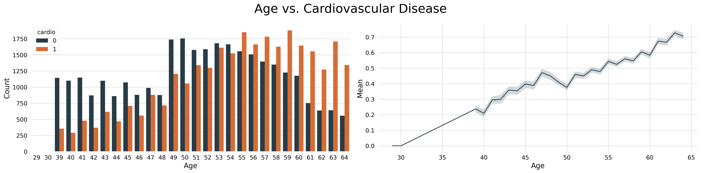
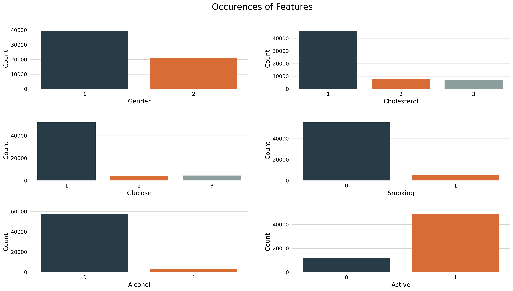
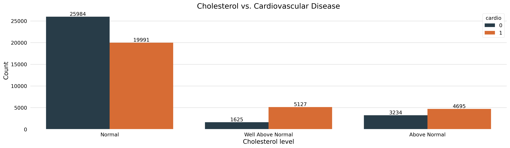

# 🫀 Cardiovascular Disease Project

## Business Understanding

### The company

Cardio Catch Disease is a healthcare company specialized in diagnosing cardiovascular disease in early stages. Its bussiness model is offering this early diagnosis of cardiovascular disease for a certain price.

### The problem
Currently, the precision of the diagnosis ranges between 55% and 65%, reflecting its complexity and the limited availability of medical doctors. The total cost per diagnosis, encompassing both equipment and analysts' compensation, is approximately $1,000.

For clients, the pricing model for the diagnosis costs $500 for every 5% increase in precision beyond the 50% baseline.

## Objective

Create a model that improves the precision of the diagnosis in a stable and efficient way for all clients.

### What to deliver

- The precision of the model
- What is the revenue of the new model?
- How reliable are the results of the new tool?

## Solution Planning

#### Dataset from [Kaggle](https://www.kaggle.com/datasets/sulianova/cardiovascular-disease-dataset)

#### CRISPDM Process

    - Business understanding
    - Data understanding
    - Data preparation
    - Data analysis
    - Feature engineering
    - Modeling
    - Model development
    - Model evaluation
    - Model deployment

#### Project Structure

    - Imports
    - Data Description
    - Preprocessing and Data Exploration
    - Exploratory Data Analysis
    - Feature Engineering
    - Machine Learning and Evaluation
    - Business Results

## Steps

- ### Imports

Importing libraries and packages (pandas, numpy, seaborn, matplotlib, boruta, sklearn, lightgbm), configuring settings, loading dataset.

- ### Data Description

Shape, dimensions, info, describe, columns, types and head of the dataset.

- ### Preprocessing and Data Exploration

Transforming `age` from days to years, checking data balance, describing numerical data, corrections on the dataset.

- ### Exploratory Data Analysis

Answering questions with graphs and charts, like:

**At what age people with cardiovascular disease outnumber people without cardiovascular disease? Are older people more at risk?**

We can see that older people are more at risk and that at 55 years old, people with cardiovascular disease outnumber the people without. 

**Occurences of features in the dataset:**

**The higher the cholesterol, the greater the risk?**

The higher the cholesterol, the greater the risk of having a cardiovascular disease.

- ### Feature Engineering

Dropping columns, creation of features like body-mass-index (BMI), correlation heatmap, train-test split, scaling with MinMaxScaler and Robust Scaler, features selection with ExtraTreesClassifier and Boruta.

- ### Machine Learning and Evaluation

    - **Machine Learning models:** Logistic Regression, Extra Trees Classifier, Random Forest Classifier, LightGBM Classifier.

    - **Evaluation metrics:** Accuracy, Precision, Recall, F1 Score, Confusion Matrix.

    - **Hyperparameters tuning:** RandomizedSearchCV on Random Forest Classifier and LightGBM Classifier.

## Business Results

**Reminder:**

Currently, the precision of the diagnosis ranges between 55% and 65%, reflecting its complexity and the limited availability of medical doctors. The total cost per diagnosis, encompassing both equipment and analysts' compensation, is approximately $1,000.

For clients, the pricing model for the diagnosis costs $500 for every 5% increase in precision beyond the 50% baseline.

**The deliverables:**

- The precision of the model now is at **75%**

- The revenue of the new model is **$173,665,751.75**

- Considering the previous precision of **65%**, the revenue was around **$105,000,000**, which results in an improvement of **$68,665,751.75** (or an increase of **65%**) using the new model.

- How reliable are the results of the new tool? The other metrics for the model are **Accuracy: 72.3%**, **Recall: 65.8%**, **F1 Score: 70%**.

***
